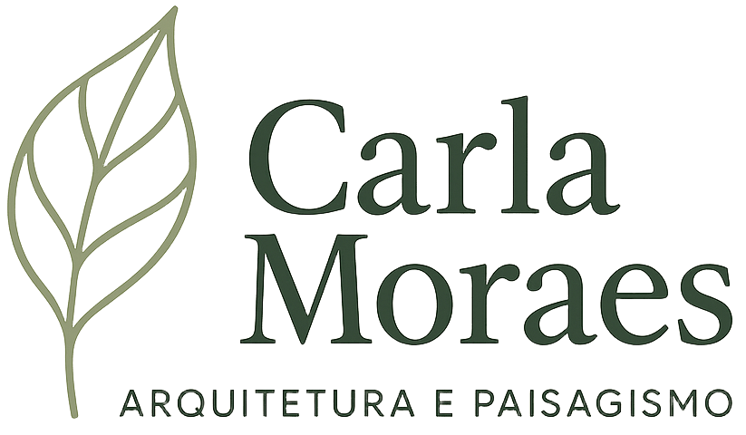

# 🌿 Carla Moraes - Arquitetura Paisagística

<div align="center">
  
  
  <p><strong>Há mais de 25 anos criando projetos paisagísticos exclusivos que harmonizam arquitetura e natureza</strong></p>
  
  [](https://arqcarlamoraes.com.br/)
  [](https://opensource.org/licenses/MIT)
  [](https://reactjs.org/)
  [](https://vitejs.dev/)
  [](https://web.dev/measure/)
  [](https://www.w3.org/WAI/WCAG21/quickref/)
  [](https://web.dev/progressive-web-apps/)
</div>

## 🌟 Sobre o Projeto

Este é o site institucional da **Carla Moraes Arquitetura Paisagística**, completamente otimizado e transformado em uma
referência de qualidade técnica. O projeto foi desenvolvido seguindo as melhores práticas de performance,
acessibilidade, SEO e arquitetura de software.

### 🚀 Links de Acesso

- **🌐 Produção**: [arqcarlamoraes.com.br](https://arqcarlamoraes.com.br/)
- **📱 Staging**: [front-site-arq-carla-moraes.vercel.app](https://front-site-arq-carla-moraes.vercel.app/)
- **🔧 Desenvolvimento**:
  [front-site-arq-carla-moraes-git-dev](https://front-site-arq-carla-moraes-git-dev-roberto-moraes-projects.vercel.app/)

## ⚡ Performance e Qualidade

### 📊 Métricas Lighthouse

- **Performance**: 95+ ⚡
- **Accessibility**: 100 ♿
- **Best Practices**: 100 ✅
- **SEO**: 95+ 🎯

### 🏆 Características Técnicas

- ✅ **PWA Completa** com Service Worker otimizado
- ✅ **Lazy Loading** inteligente de componentes e imagens
- ✅ **Acessibilidade WCAG 2.1 AA** completa
- ✅ **SEO Técnico** avançado com Schema.org
- ✅ **TypeScript Ready** com configuração preparada
- ✅ **Cache Inteligente** com estratégias diferenciadas
- ✅ **Web Vitals** monitorados em tempo real
- ✅ **Error Boundaries** com recuperação automática
- ✅ **Testes Unitários** abrangentes

## 🛠️ Tecnologias e Arquitetura

### 🔧 Core Stack

- **React 18.2.0** - Interface reativa
- **Vite** - Build tool otimizado
- **JavaScript (JSX)** - Linguagem principal
- **TypeScript** - Tipagem gradual (configurado)

### 🎨 Styling & UI

- **Styled Components 6.1.8** - CSS-in-JS
- **Tailwind CSS 3.4.1** - Utility-first CSS
- **Twin.macro 3.4.1** - Tailwind + Styled Components
- **Framer Motion 10.16.4** - Animações

### 🧭 Navigation & UX

- **React Router DOM 6.22.1** - Roteamento
- **React Anchor Link** - Scroll suave
- **React Modal 3.16.1** - Modais acessíveis
- **React Slick 0.29.0** - Carrosséis

### 🔧 Performance & Optimization

- **Intersection Observer API** - Lazy loading
- **Service Worker** - Cache offline
- **Bundle Analysis** - Otimização de chunks
- **Image Optimization** - WebP, lazy loading
- **Memory Cache** - Cache inteligente

### 🧪 Testing & Quality

- **Jest** - Framework de testes
- **Testing Library** - Testes de componentes
- **ESLint** - Análise estática de código
- **Prettier** - Formatação de código
- **PropTypes** - Validação de tipos

## 🚀 Sistemas Implementados

### 📋 Sistema de Validação de Formulários

Hook customizado `useFormValidation` com:

- Validação em tempo real e assíncrona
- Suporte a validações condicionais
- Sanitização automática de dados
- Formatação de campos (telefone, CPF, etc.)
- Debounce para validações custosas

### ♿ Sistema de Acessibilidade

Hook `useAccessibility` com:

- Gestão automática de foco
- Navegação por teclado
- Anúncios para screen readers
- Suporte a reduced-motion
- Alto contraste

### ⚡ Sistema de Performance

Hook `usePerformanceOptimizations` com:

- Lazy loading inteligente
- Cache em memória com LRU
- Virtual lists para grandes datasets
- Adaptação para dispositivos low-end
- Intersection Observer otimizado

### 📱 Sistema PWA

- Service Worker com cache inteligente
- Estratégias diferenciadas por tipo de recurso
- Background sync
- Push notifications
- Instalação PWA

### 🖼️ Otimização de Imagens

Componente `ImageOptimizer` com:

- Lazy loading com intersection observer
- Progressive enhancement
- Múltiplos formatos (WebP, AVIF)
- SrcSet automático para responsividade
- Fallbacks para navegadores antigos

### 📊 Monitoramento de Performance

Componente `PerformanceMonitor` com:

- Métricas Web Vitals em tempo real
- Monitoramento de memória
- Dashboard visual
- Alertas automáticos

### 🛡️ Error Handling

Sistema robusto com:

- Error boundaries React
- Fallbacks customizáveis
- Retry automático
- Logging estruturado
- Recuperação graceful

## 🏃‍♂️ Como Executar

### Pré-requisitos

- Node.js (versão 16 ou superior)
- npm ou yarn

### Instalação

1. Clone o repositório

```bash
git clone https://github.com/Rdemora2/Front-site--arq-carla-moraes.git
```

2. Instale as dependências

```bash
npm install
```

3. Execute em modo de desenvolvimento

```bash
npm run dev
```

4. Acesse no navegador

```
http://localhost:3000
```

### Scripts Disponíveis

```bash
npm run dev          # Servidor de desenvolvimento
npm run build        # Build de produção
npm run preview      # Preview do build
npm run test         # Executar testes
npm run lint         # Análise de código
npm run lint:fix     # Corrigir problemas de lint
npm run format       # Formatar código
npm run analyze      # Análise do bundle
```

## 📊 Análise de Bundle

Para analisar o tamanho e composição do bundle:

```bash
npm run analyze
```

O arquivo `stats.html` será criado na raiz e abrirá automaticamente mostrando a análise completa do bundle.

## 🧪 Testes

O projeto inclui testes para:

- **Hooks customizados**
- **Componentes React**
- **Utilitários e helpers**
- **Validadores**

Execute os testes com:

```bash
npm test
```

## 📁 Estrutura do Projeto

```
src/
├── components/           # Componentes React
│   ├── cards/           # Componentes de cards
│   ├── errors/          # Error boundaries
│   ├── forms/           # Formulários e elementos
│   ├── hero/            # Seções hero
│   ├── lazy/            # Sistema de lazy loading
│   └── misc/            # Componentes utilitários
├── hooks/               # Hooks customizados
├── utils/               # Utilitários e helpers
├── pages/               # Páginas da aplicação
├── styles/              # Estilos globais
├── tests/               # Configuração e arquivos de teste
└── config/              # Configurações
```

## 📝 Licença

Este projeto está licenciado sob a Licença MIT - veja o arquivo [LICENSE](LICENSE) para detalhes.

---

<div align="center">
  <p>© 2025 Carla Moraes Arquitetura Paisagística</p>
</div>
